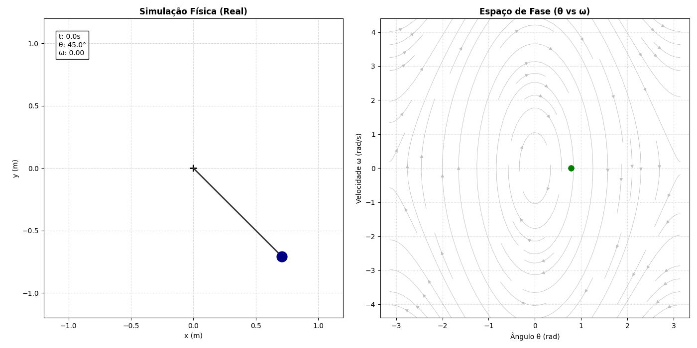

# PyPendulum

> **Simulador de Dinâmica Não-Linear e Caos Determinístico**
>
> *Feito por: Thales Serafim Santore | Projeto Final de Computação 1 25.2 - POLI UFRJ*


---

## 1) Demonstração Visual

### (1.1) Dual View: Física e Espaço de Fase
Visualização simultânea do comportamento físico (esquerda) e da trajetória no espaço de fase (direita). O gráfico da direita traça a velocidade ($\omega$) em função do ângulo ($\theta$), essencial para visualizar ciclos limites e estabilidade.

<div align="center">
  
  <p><em>Exemplo: Pêndulo Simples/Forçado com Retrato de Fase</em></p>
</div>

<br>

### (1.2) O Efeito Borboleta (Caos)
Demonstração visual da sensibilidade às condições iniciais no **Pêndulo Duplo**. Cinco simulações são iniciadas simultaneamente com variações infinitesimais (0.005 rad). Em poucos segundos, as trajetórias divergem completamente, ilustrando a imprevisibilidade do caos.

<div align="center">
  
  <p><em>Exemplo: Divergência de 5 trajetórias próximas</em></p>
</div>

---

## 2) Sobre o Projeto

O **PyPendulum** é uma ferramenta de simulação física desenvolvida para resolver e visualizar equações diferenciais de movimento para três sistemas distintos:

1.  **Pêndulo Simples:** Sistema conservativo ideal.
2.  **Pêndulo Amortecido e Forçado:** Estudo de atrito viscoso e ressonância.
3.  **Pêndulo Duplo:** Estudo de sistemas caóticos acoplados.

Eu desenvolvi esse projeto com o objetivo de alunos de física no nivel ensino medio/superior terem uma visualização mais facilitada do que esta acontecendo com a sua matemática.
O software utiliza integração numérica de alta precisão para resolver as equações diferenciais, tanto a simples quando as acopladas (**Runge-Kutta 4ª Ordem**).

---

## 3) Tecnologias Utilizadas

* **Linguagem:** Python 3
* **Matemática:** `NumPy` e `SciPy` (Solver `solve_ivp` RK45).
* **Gráficos:** `Matplotlib` (Módulo `animation` com Blitting para alta performance).
* **Engenharia de Software:** Persistência de dados via `JSON` com sistema de compatibilidade retroativa.

---

## 4) Como Rodar

1. **Clone o repositório:**
   ```bash
   git clone [https://github.com/SaiyanDuck/PyPendulum.git](https://github.com/SaiyanDuck/PyPendulum.git)
   cd PyPendulum

## 5) Projetos Futuros

O progama se encontra finalizado pelo proposito que foi proposto, entretanto há a possibilidade de novas atualizações para adicionar algumas features.
Eu coloquei a versão 0.91 pois sei que ainda tem alguns bugs que tenho que corrigir mas no momento me encontro sem tempo, quando corrigido, irei lançar a versão 1.0.
O software é livre e eu fico feliz da comunidade utilizar a vontade, a unica coisa que peço é pelo reconhecimento da minha autoria, Thales Serafim.

**Possiveis atualizações**

1.  **Pendulo Conico (3D)**
2.  **Pendulo elastico**
3.  **Pendulo de foucalt**
4.  **Remoção de limitação de comprimento e massa para o pendulo duplo**
5.  **Plot do retrato de fase para outros casos sem ser o pendulo simples**
